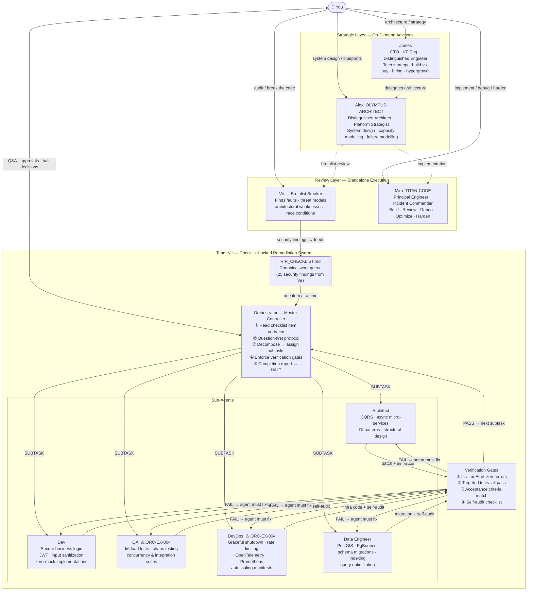

# SpendOS AI-Agent Infrastructure

```mermaid
graph TD
    Human(["👤 You"])

    subgraph Strategic["Strategic Layer — On-Demand Advisors"]
        James["James\nCTO · VP Eng · Distinguished Engineer\nTech strategy · build-vs-buy · hiring · hypergrowth"]
        Alex["Alex  OLYMPUS-ARCHITECT\nDistinguished Architect · Platform Strategist\nSystem design · capacity modelling · failure modelling"]
    end

    subgraph Review["Review Layer — Standalone Execution"]
        Vir["Vir — Brutalist Breaker\nFinds faults · threat models\narchitectural weaknesses · race conditions"]
        Mira["Mira  TITAN-CODE\nPrincipal Engineer · Incident Commander\nBuild · Review · Debug · Optimize · Harden"]
    end

    subgraph TeamVir["Team Vir — Checklist-Locked Remediation Swarm"]
        Checklist[["VIR_CHECKLIST.md\nCanonical work queue\n(25 security findings from Vir)"]]
        Orch["Orchestrator — Master Controller\n① Read checklist item verbatim\n② Question-first protocol\n③ Decompose → assign subtasks\n④ Enforce verification gates\n⑤ Completion report → HALT"]

        subgraph SubAgents["Sub-Agents"]
            ArchAgent["Architect\nCQRS · async micro-services\nDI patterns · structural design"]
            DevAgent["Dev\nSecure business logic\nJWT · input sanitization\nzero-mock implementations"]
            QAAgent["QA  ⚠ ORC-EX-004\nk6 load tests · chaos testing\nconcurrency & integration suites"]
            DevOpsAgent["DevOps  ⚠ ORC-EX-004\nGraceful shutdown · rate limiting\nOpenTelemetry · Prometheus\nautoscaling manifests"]
            DataAgent["Data Engineer\nPostGIS · PgBouncer\nschema migrations · indexing\nquery optimization"]
        end

        Gates["Verification Gates\n① tsc --noEmit  zero errors\n② Targeted tests  all pass\n③ Acceptance criteria match\n④ Self-audit checklist"]
    end

    Human -->|architecture / strategy| James
    Human -->|system design / blueprints| Alex
    Human -->|audit / break the code| Vir
    Human -->|implement / debug / harden| Mira
    Human <-->|Q&A · approvals · halt decisions| Orch

    Vir -->|"security findings → feeds"| Checklist
    Checklist -->|one item at a time| Orch

    Orch -->|SUBTASK| ArchAgent
    Orch -->|SUBTASK| DevAgent
    Orch -->|SUBTASK| QAAgent
    Orch -->|SUBTASK| DevOpsAgent
    Orch -->|SUBTASK| DataAgent

    ArchAgent -->|patch + self-audit| Gates
    DevAgent  -->|patch + self-audit| Gates
    QAAgent   -->|test results + self-audit| Gates
    DevOpsAgent -->|infra code + self-audit| Gates
    DataAgent -->|migration + self-audit| Gates

    Gates -->|PASS → next subtask| Orch
    Gates -->|FAIL → agent must fix| ArchAgent
    Gates -->|FAIL → agent must fix| DevAgent
    Gates -->|FAIL → agent must fix| QAAgent
    Gates -->|FAIL → agent must fix| DevOpsAgent
    Gates -->|FAIL → agent must fix| DataAgent

    James -.->|delegates architecture| Alex
    Alex  -.->|brutalist review| Vir
    Alex  -.->|implementation| Mira
```
