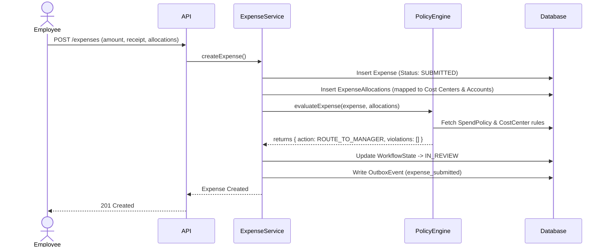
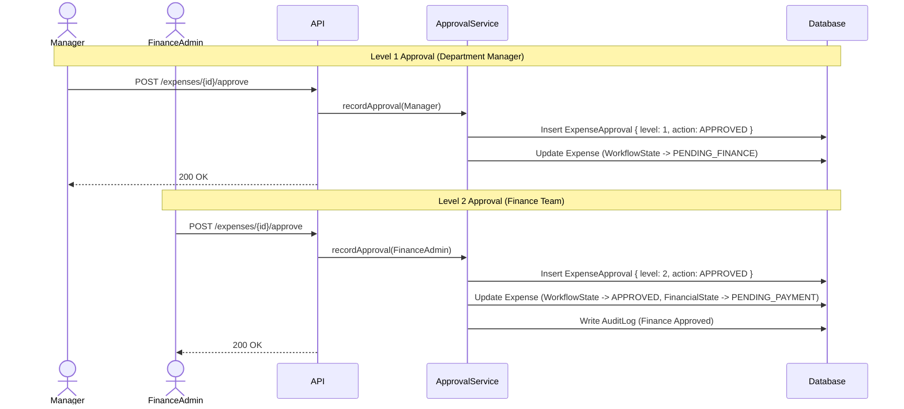
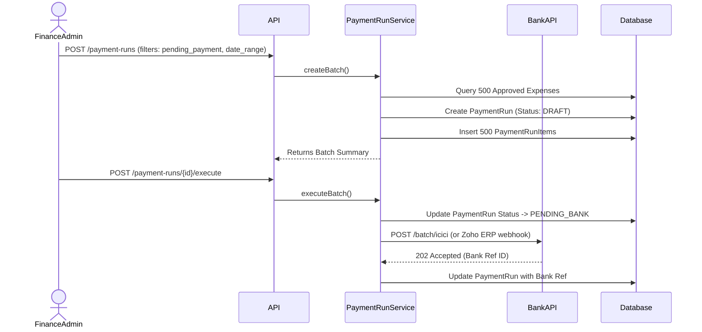
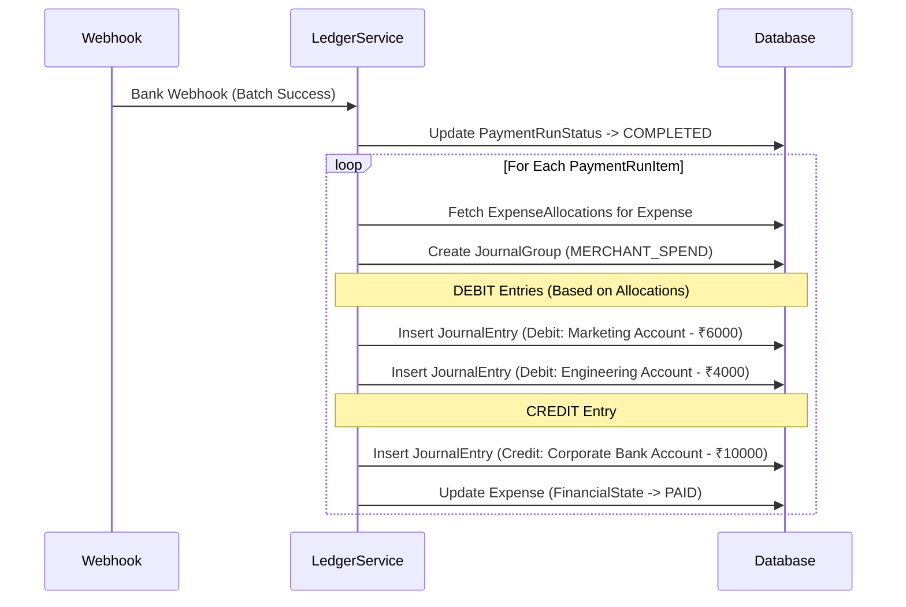

# Backend Architecture Visualization (Enterprise Expansion)

The following diagrams visualize how the backend processes expenses, handles policies, manages multi-level approvals, and eventually executes payment runs and ledger allocations using the new enterprise tables.

## 1. Expense Submission & Policy Evaluation

When an employee submits an expense, the system now splits the expense across cost centers and evaluates it against the policy engine.

## 2. Multi-Level Approval Workflow

Replacing the single-tier approval, the system now writes to the `expense_approvals` table to maintain a strict chain of custody.

## 3. Batched Payment Runs

Instead of marking expenses paid one-by-one, Finance initiates a bulk payment run.

## 4. Double-Entry Ledger Allocation (Source of Truth)

Once the payment run is confirmed, the system maps the allocations to actual immutable ledger journal entries.

